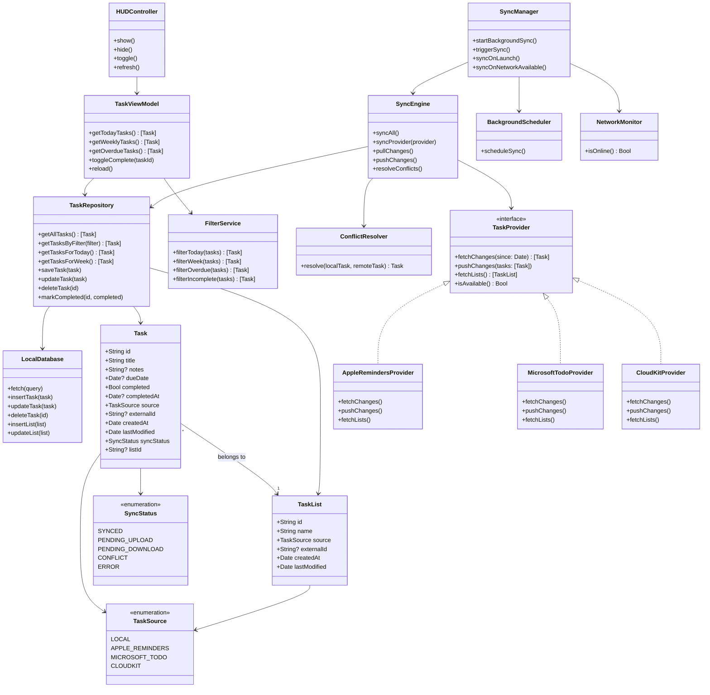
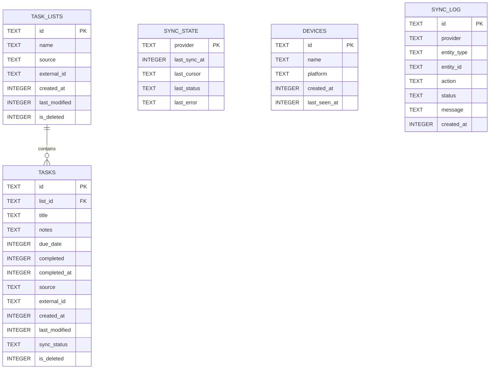
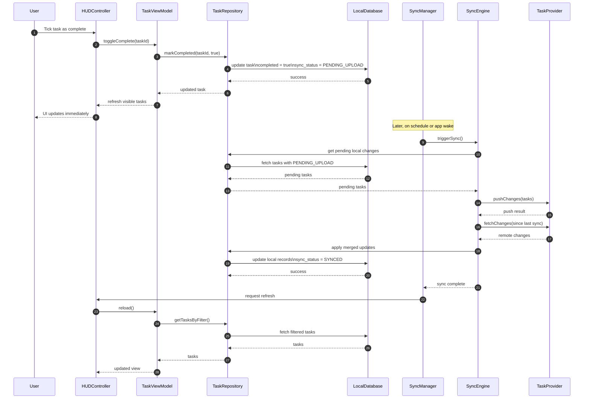

# Task Overlay App Architecture

This document captures the **base architectural concept** for a macOS task overlay / HUD application with:

- a **local-first task database**
- **offline-first behaviour**
- optional synchronisation with:
  - Apple Reminders
  - Microsoft To Do
  - CloudKit
- a floating **HUD / overlay** for viewing and completing tasks such as:
  - Today
  - This Week
  - Overdue

---

## 1. High-Level Architectural Overview



---

## 2. Entity Relationship Diagram (ERD)

This ERD represents a pragmatic **local SQLite schema** for the first version of the application.



---

## 3. Sync Sequence Diagram

This diagram shows a typical sync cycle for a user ticking off a task while offline, followed by background synchronisation when connectivity returns.



---

## 4. Suggested Database Tables

### `task_lists`
Stores logical lists such as:
- Personal
- Work
- Imported Reminders list
- Imported Microsoft To Do list

### `tasks`
Stores all tasks in a provider-neutral format.

### `sync_state`
Stores per-provider sync metadata, such as:
- last sync timestamp
- pagination or delta cursor
- error state

### `devices`
Optional future table for tracking device identity if you later support your own sync service.

### `sync_log`
Useful for:
- debugging
- diagnostics
- conflict analysis
- support logs

---

## 5. Suggested Initial SQLite Schema

```sql
CREATE TABLE task_lists (
    id TEXT PRIMARY KEY,
    name TEXT NOT NULL,
    source TEXT NOT NULL,
    external_id TEXT,
    created_at INTEGER NOT NULL,
    last_modified INTEGER NOT NULL,
    is_deleted INTEGER NOT NULL DEFAULT 0
);

CREATE TABLE tasks (
    id TEXT PRIMARY KEY,
    list_id TEXT,
    title TEXT NOT NULL,
    notes TEXT,
    due_date INTEGER,
    completed INTEGER NOT NULL DEFAULT 0,
    completed_at INTEGER,
    source TEXT NOT NULL,
    external_id TEXT,
    created_at INTEGER NOT NULL,
    last_modified INTEGER NOT NULL,
    sync_status TEXT NOT NULL DEFAULT 'SYNCED',
    is_deleted INTEGER NOT NULL DEFAULT 0,
    FOREIGN KEY (list_id) REFERENCES task_lists(id)
);

CREATE TABLE sync_state (
    provider TEXT PRIMARY KEY,
    last_sync_at INTEGER,
    last_cursor TEXT,
    last_status TEXT,
    last_error TEXT
);

CREATE TABLE devices (
    id TEXT PRIMARY KEY,
    name TEXT NOT NULL,
    platform TEXT NOT NULL,
    created_at INTEGER NOT NULL,
    last_seen_at INTEGER NOT NULL
);

CREATE TABLE sync_log (
    id TEXT PRIMARY KEY,
    provider TEXT NOT NULL,
    entity_type TEXT NOT NULL,
    entity_id TEXT NOT NULL,
    action TEXT NOT NULL,
    status TEXT NOT NULL,
    message TEXT,
    created_at INTEGER NOT NULL
);

CREATE INDEX idx_tasks_due_date ON tasks(due_date);
CREATE INDEX idx_tasks_completed ON tasks(completed);
CREATE INDEX idx_tasks_sync_status ON tasks(sync_status);
CREATE INDEX idx_tasks_list_id ON tasks(list_id);
CREATE INDEX idx_tasks_last_modified ON tasks(last_modified);
```

---

## 6. Suggested Folder / Module Structure

```text
/Core
  Task.swift
  TaskList.swift
  TaskSource.swift
  SyncStatus.swift

/Data
  LocalDatabase.swift
  TaskRepository.swift
  TaskMapper.swift

/Sync
  SyncManager.swift
  SyncEngine.swift
  ConflictResolver.swift
  SyncStateStore.swift

/Providers
  TaskProvider.swift
  AppleRemindersProvider.swift
  MicrosoftTodoProvider.swift
  CloudKitProvider.swift

/UI
  HUDController.swift
  TaskViewModel.swift
  FilterService.swift
  OverlayPanel.swift

/System
  BackgroundScheduler.swift
  NetworkMonitor.swift
```

---

## 7. Architectural Notes

### Local-first
The local database should remain the **immediate source of truth for the UI**.  
All user actions should write locally first, then sync asynchronously.

### Eventual consistency
Remote providers should be treated as integration endpoints, not as the UI’s primary backing store.

### Provider-neutral task model
The app should map Apple Reminders, Microsoft To Do, and CloudKit records into one internal task format.

### Conflict strategy
For the MVP, a simple **last-write-wins** model based on `last_modified` is sufficient.

### Offline support
A task should be completable even when no network or provider access is available.  
The sync engine can upload the change later.

---

## 8. MVP Recommendation

A sensible MVP would be:

1. Local SQLite database
2. HUD / overlay UI
3. Filters for:
   - Today
   - This Week
   - Overdue
4. Mark complete / incomplete
5. Background sync engine skeleton
6. Apple Reminders integration first
7. CloudKit second
8. Microsoft To Do after core sync is stable

---

## 9. Future Extensions

Potential future additions:

- subtasks
- tags
- recurring tasks
- natural language date parsing
- own backend sync
- macOS menu bar mode
- iPhone / iPad companion app
- user analytics / sync diagnostics panel
