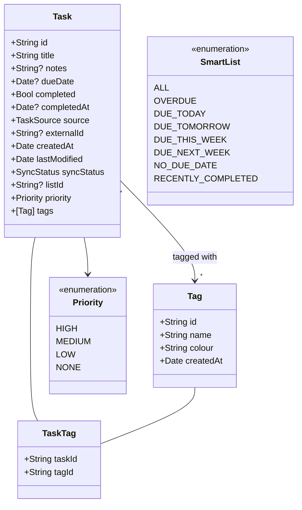
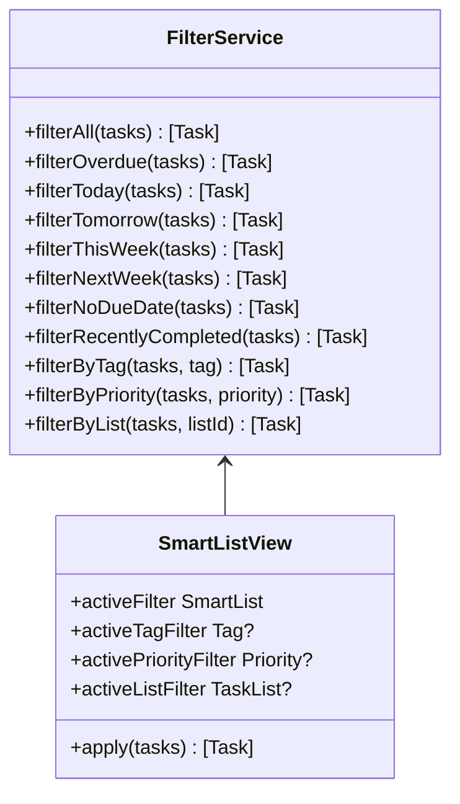
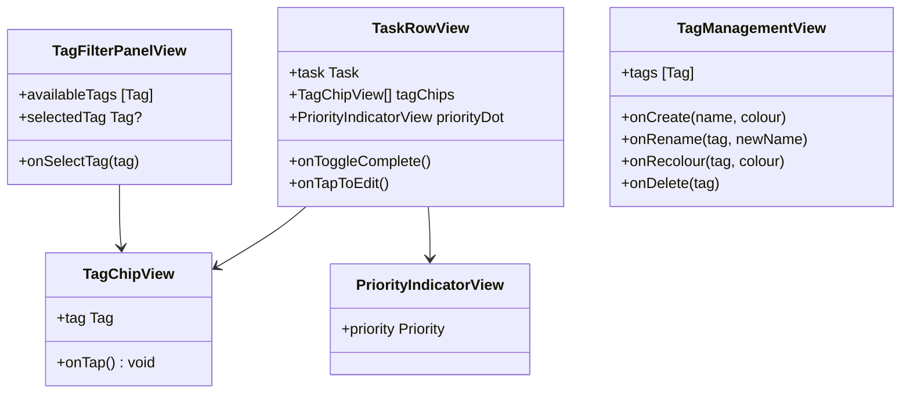
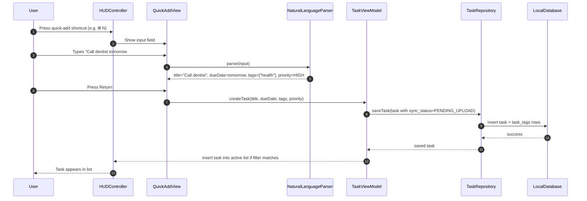
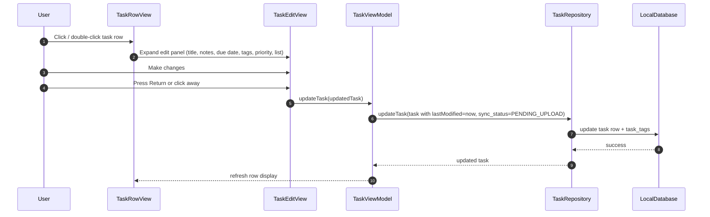

# Task Overlay App — Architecture Extensions

This document extends `task_overlay_architecture.md` with additional features planned after the initial MVP:

- Expanded smart list filters
- Categories / tags with priority levels
- Task creation and inline editing from the HUD

---

## 1. Updated Domain Model

### New and modified entities



---

## 2. Updated Entity Relationship Diagram

```mermaid
erDiagram

    TASK_LISTS {
        TEXT id PK
        TEXT name
        TEXT source
        TEXT external_id
        INTEGER created_at
        INTEGER last_modified
        INTEGER is_deleted
    }

    TASKS {
        TEXT id PK
        TEXT list_id FK
        TEXT title
        TEXT notes
        INTEGER due_date
        INTEGER completed
        INTEGER completed_at
        TEXT source
        TEXT external_id
        INTEGER created_at
        INTEGER last_modified
        TEXT sync_status
        INTEGER is_deleted
        TEXT priority
    }

    TAGS {
        TEXT id PK
        TEXT name
        TEXT colour
        INTEGER created_at
    }

    TASK_TAGS {
        TEXT task_id FK
        TEXT tag_id FK
    }

    SYNC_STATE {
        TEXT provider PK
        INTEGER last_sync_at
        TEXT last_cursor
        TEXT last_status
        TEXT last_error
    }

    SYNC_LOG {
        TEXT id PK
        TEXT provider
        TEXT entity_type
        TEXT entity_id
        TEXT action
        TEXT status
        TEXT message
        INTEGER created_at
    }

    TASK_LISTS ||--o{ TASKS : contains
    TASKS ||--o{ TASK_TAGS : has
    TAGS ||--o{ TASK_TAGS : applied to
```

---

## 3. Extended SQLite Schema

### New columns and tables to add on top of the base schema

```sql
-- Add priority to existing tasks table
ALTER TABLE tasks ADD COLUMN priority TEXT NOT NULL DEFAULT 'NONE';

-- Tags
CREATE TABLE tags (
    id TEXT PRIMARY KEY,
    name TEXT NOT NULL,
    colour TEXT NOT NULL DEFAULT '#888888',
    created_at INTEGER NOT NULL
);

-- Junction table: many tasks <-> many tags
CREATE TABLE task_tags (
    task_id TEXT NOT NULL,
    tag_id TEXT NOT NULL,
    PRIMARY KEY (task_id, tag_id),
    FOREIGN KEY (task_id) REFERENCES tasks(id) ON DELETE CASCADE,
    FOREIGN KEY (tag_id) REFERENCES tags(id) ON DELETE CASCADE
);

CREATE INDEX idx_task_tags_task_id ON task_tags(task_id);
CREATE INDEX idx_task_tags_tag_id ON task_tags(tag_id);
CREATE INDEX idx_tasks_priority ON tasks(priority);
```

---

## 4. Expanded FilterService



**Date boundary rules:**

| Smart List | Condition |
|---|---|
| Overdue | `dueDate < startOfToday && !completed` |
| Due Today | `dueDate >= startOfToday && dueDate < startOfTomorrow && !completed` |
| Due Tomorrow | `dueDate >= startOfTomorrow && dueDate < startOfDayAfterTomorrow && !completed` |
| Due This Week | `dueDate in [startOfThisWeek, endOfThisWeek] && !completed` |
| Due Next Week | `dueDate in [startOfNextWeek, endOfNextWeek] && !completed` |
| No Due Date | `dueDate == nil && !completed` |
| Recently Completed | `completed && completedAt >= 7 days ago` |

---

## 5. Tag and Priority UI Components



---

## 6. Task Creation and Editing

### Quick-add flow



### Natural language parser shortcuts

| Input | Result |
|---|---|
| `today`, `tod` | dueDate = today |
| `tomorrow`, `tom` | dueDate = tomorrow |
| `next friday`, `fri` | dueDate = next Friday |
| `in 3 days` | dueDate = today + 3 |
| `#tagname` | add tag named "tagname" |
| `!` | priority = HIGH |
| `!!` | priority = MEDIUM |

### Inline edit flow



---

## 7. New and Updated Module Structure

```text
/Core
  Task.swift              ← updated: adds priority, tags fields
  TaskList.swift
  TaskSource.swift
  SyncStatus.swift
  Tag.swift               ← NEW
  Priority.swift          ← NEW
  SmartList.swift         ← NEW: enum of all filter views

/Data
  LocalDatabase.swift     ← updated: tags, task_tags tables + migration
  TaskRepository.swift    ← updated: tag association methods
  TagRepository.swift     ← NEW: CRUD for tags
  TaskMapper.swift        ← updated: maps tags, priority

/Sync
  SyncManager.swift
  SyncEngine.swift
  ConflictResolver.swift
  SyncStateStore.swift

/Providers
  TaskProvider.swift
  AppleRemindersProvider.swift
  MicrosoftTodoProvider.swift
  CloudKitProvider.swift

/UI
  HUDController.swift
  TaskViewModel.swift     ← updated: smart list switching, tag/priority filters
  FilterService.swift     ← updated: all new filter methods
  SmartListView.swift     ← NEW: active filter state + composition
  OverlayPanel.swift
  TaskRowView.swift       ← NEW: row with tag chips + priority dot
  TagChipView.swift       ← NEW
  PriorityIndicatorView.swift  ← NEW
  TagFilterPanelView.swift     ← NEW
  TagManagementView.swift      ← NEW
  QuickAddView.swift      ← NEW
  TaskEditView.swift      ← NEW
  NaturalLanguageParser.swift  ← NEW

/System
  BackgroundScheduler.swift
  NetworkMonitor.swift
```

---

## 8. Architectural Notes (Extensions)

### Tags are local-first
Tags exist only in the local database for now. When syncing to Apple Reminders or Microsoft To Do, tags are stored as reminder notes or task body annotations (e.g. `#tagname`) rather than native provider fields, since those providers have limited native tag support. CloudKit can store tags natively as a `CKRecord` list field.

### Priority mapping

| Internal | Apple Reminders | Microsoft To Do | CloudKit |
|---|---|---|---|
| HIGH | `.high` priority | `importance: high` | `priority: 1` |
| MEDIUM | `.medium` | `importance: normal` | `priority: 5` |
| LOW | `.low` | `importance: low` | `priority: 9` |
| NONE | `.none` | `importance: normal` | `priority: 0` |

### Smart list persistence
The user's last active smart list filter is persisted in `UserDefaults`. Tag and priority filters are session-only (reset on HUD hide).

### Natural language parsing
Use a lightweight local parser first (regex + date arithmetic). If richer parsing is needed later, consider integrating with `NSDataDetector` for date extraction or a small local LLM.
